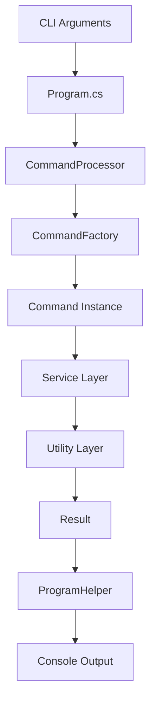
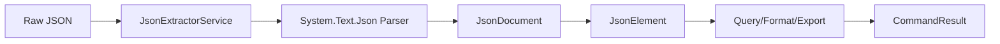
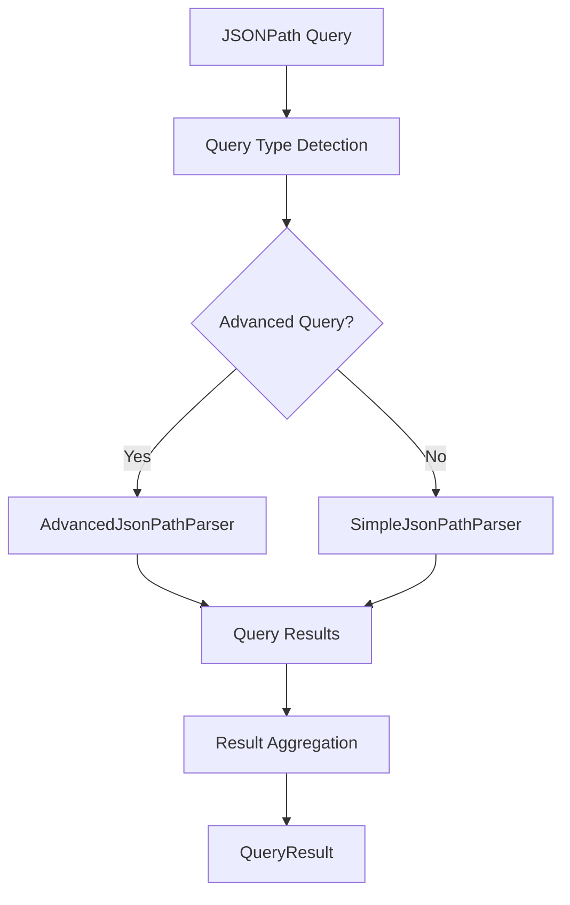

# JSON Extractor Architecture Guide

Comprehensive guide to the design patterns, architectural decisions, and extension points in the JSON Extractor console application.

## Table of Contents

1. [Architecture Overview](#architecture-overview)
2. [Design Principles](#design-principles)
3. [Core Components](#core-components)
4. [Design Patterns](#design-patterns)
5. [Data Flow](#data-flow)
6. [Dependency Management](#dependency-management)
7. [Extension Points](#extension-points)
8. [Performance Considerations](#performance-considerations)
9. [Security Architecture](#security-architecture)
10. [Testing Architecture](#testing-architecture)
11. [Deployment Considerations](#deployment-considerations)

## Architecture Overview

JSON Extractor follows a **modular, service-oriented architecture** built on .NET 9.0 with emphasis on maintainability, extensibility, and testability.

### High-Level Architecture

```
┌─────────────────────────────────────────────────────────────┐
│                    Console Interface Layer                  │
├─────────────────────────────────────────────────────────────┤
│                    Command Layer                            │
│  ┌─────────────┐ ┌─────────────┐ ┌─────────────┐           │
│  │ParseCommand │ │QueryCommand │ │ExportCommand│    ...    │
│  └─────────────┘ └─────────────┘ └─────────────┘           │
├─────────────────────────────────────────────────────────────┤
│                    Service Layer                            │
│  ┌──────────────────┐ ┌──────────────────┐                │
│  │JsonExtractorSvc  │ │JsonQueryService  │     ...        │
│  └──────────────────┘ └──────────────────┘                │
├─────────────────────────────────────────────────────────────┤
│                    Utility Layer                            │
│  ┌─────────────┐ ┌─────────────┐ ┌─────────────┐           │
│  │CsvExporter  │ │XmlExporter  │ │JsonExporter │    ...    │
│  └─────────────┘ └─────────────┘ └─────────────┘           │
├─────────────────────────────────────────────────────────────┤
│                    Infrastructure Layer                     │
│  ┌─────────────────┐ ┌─────────────────┐                  │
│  │Logging          │ │Configuration    │      ...         │
│  └─────────────────┘ └─────────────────┘                  │
└─────────────────────────────────────────────────────────────┘
```

### Key Architectural Characteristics

- **Separation of Concerns**: Clear layer boundaries with specific responsibilities
- **Dependency Inversion**: High-level modules don't depend on low-level modules
- **Open/Closed Principle**: Open for extension, closed for modification
- **Single Responsibility**: Each component has one clear purpose
- **Testability**: Comprehensive unit and integration testing support

## Design Principles

### 1. SOLID Principles Implementation

#### Single Responsibility Principle (SRP)
- **Commands**: Each command handles one specific operation
- **Services**: Focused on specific domain logic (parsing vs. querying)
- **Utilities**: Single-purpose export functionality

#### Open/Closed Principle (OCP)
- **Command System**: New commands can be added without modifying existing code
- **Export System**: New export formats through interface implementation
- **Query Engine**: Extensible JSONPath processing

#### Liskov Substitution Principle (LSP)
- **ICommand Interface**: All commands are interchangeable
- **Service Interfaces**: Implementations can be substituted without breaking clients

#### Interface Segregation Principle (ISP)
- **Focused Interfaces**: `IJsonExtractorService` vs. `IJsonQueryService`
- **Minimal Dependencies**: Commands depend only on required services

#### Dependency Inversion Principle (DIP)
- **Abstraction Dependencies**: High-level components depend on interfaces
- **Dependency Injection**: Runtime binding of concrete implementations

### 2. Additional Design Principles

#### Fail-Fast Principle
- **Validation**: Early parameter and configuration validation
- **Error Handling**: Immediate failure with clear error messages

#### Principle of Least Astonishment
- **Consistent APIs**: Uniform command interface and response patterns
- **Predictable Behavior**: Standard .NET conventions and patterns

## Core Components

### 1. Entry Point and Bootstrapping

#### Program.cs
```csharp
// Application bootstrapping
var services = ServiceContainer.ConfigureServices();
var processor = services.GetRequiredService<ICommandProcessor>();
var helper = services.GetRequiredService<ProgramHelper>();

// Command processing pipeline
var result = await processor.ProcessCommandAsync(args);
helper.DisplayResult(result);
```

**Responsibilities:**
- Dependency injection container setup
- Command-line argument processing
- Application lifecycle management
- Error handling and logging initialization

### 2. Command System Architecture

#### Command Pattern Implementation
```csharp
public interface ICommand
{
    string Name { get; }
    string Description { get; }
    Task<CommandResult> ExecuteAsync(string[] args);
}
```

#### Command Factory Pattern
```csharp
public class CommandFactory : ICommandFactory
{
    private static readonly Dictionary<string, Type> CommandTypes = new()
    {
        { "parse", typeof(ParseCommand) },
        { "query", typeof(QueryCommand) },
        { "format", typeof(FormatCommand) },
        { "export", typeof(ExportCommand) },
        { "help", typeof(HelpCommand) }
    };
    
    public ICommand CreateCommand(string commandName)
    {
        // Factory implementation with dependency injection
    }
}
```

**Design Benefits:**
- **Extensibility**: Easy addition of new commands
- **Testability**: Individual command unit testing
- **Maintainability**: Isolated command logic
- **Consistency**: Uniform command interface

### 3. Service Layer Architecture

#### JsonExtractorService
**Core Responsibilities:**
- JSON parsing and validation
- Format conversion and prettification
- File I/O operations
- Error handling and logging

**Key Design Features:**
- **Async Operations**: Non-blocking I/O for file operations
- **Options Pattern**: Configurable behavior through `ExtractorOptions`
- **Resource Management**: Proper disposal of `JsonDocument` instances
- **Error Boundaries**: Consistent error handling and reporting

#### JsonQueryService
**Core Responsibilities:**
- JSONPath expression parsing and execution
- Advanced query operations (recursive search, filtering)
- Query result aggregation and formatting
- Performance monitoring and optimization

**Dual Query Engine Design:**
```csharp
public QueryResult ExecuteJsonPath(JsonElement rootElement, string jsonPath)
{
    // Determine query complexity
    if (IsAdvancedJsonPath(jsonPath))
    {
        return AdvancedJsonPathParser.ExecuteAdvancedJsonPath(rootElement, jsonPath);
    }
    
    // Use simple parser for basic queries
    return ExecuteSimpleJsonPath(rootElement, jsonPath);
}
```

### 4. Utility Layer Architecture

#### Export System Design
```csharp
// Strategy pattern for different export formats
public class ExportCommand : ICommand
{
    private string ExportToFormat(IEnumerable<JsonElement> elements, string format, Dictionary<string, string> options)
    {
        return format switch
        {
            "csv" => ExportToCsv(elements, options),
            "xml" => ExportToXml(elements, options),
            "json" => ExportToJson(elements, options),
            _ => throw new ArgumentException($"Unsupported export format: {format}")
        };
    }
}
```

**Design Benefits:**
- **Strategy Pattern**: Pluggable export formats
- **Static Utilities**: Stateless, testable export logic
- **Option Pattern**: Configurable export behavior

## Design Patterns

### 1. Command Pattern
**Implementation:**
- `ICommand` interface defines execution contract
- `CommandFactory` creates command instances
- `CommandProcessor` orchestrates command execution

**Benefits:**
- Decouples command invocation from execution
- Supports undo/redo operations (future extension)
- Enables command queuing and logging

### 2. Factory Pattern
**Implementation:**
- `CommandFactory` creates command instances
- `ServiceContainer` creates service instances
- Type registration with dependency injection

**Benefits:**
- Centralized object creation
- Supports dependency injection
- Easy to test and mock

### 3. Strategy Pattern
**Implementation:**
- Export format selection
- JSONPath parser selection (simple vs. advanced)
- Configuration section handling

**Benefits:**
- Runtime algorithm selection
- Easy addition of new strategies
- Testable individual strategies

### 4. Template Method Pattern
**Implementation:**
- Base command execution flow
- Common error handling patterns
- Standardized result formatting

**Benefits:**
- Consistent command behavior
- Reduced code duplication
- Easier maintenance

### 5. Observer Pattern
**Implementation:**
- Logging system integration
- Configuration change notifications
- Command execution monitoring

**Benefits:**
- Loose coupling between components
- Extensible notification system
- Centralized logging and monitoring

## Data Flow

### 1. Command Execution Flow



### 2. JSON Processing Pipeline



### 3. Query Processing Pipeline



## Dependency Management

### 1. Dependency Injection Container

```csharp
public static class ServiceContainer
{
    public static IServiceProvider ConfigureServices()
    {
        var services = new ServiceCollection();
        
        // Core services
        services.AddSingleton<IJsonExtractorService, JsonExtractorService>();
        services.AddSingleton<IJsonQueryService, JsonQueryService>();
        services.AddSingleton<IConfigurationService, ConfigurationService>();
        
        // Commands
        services.AddSingleton<ICommand, ParseCommand>();
        services.AddSingleton<ICommand, QueryCommand>();
        // ... other commands
        
        // Infrastructure
        services.AddSingleton<ICommandProcessor, CommandProcessor>();
        services.AddSingleton<ICommandFactory, CommandFactory>();
        
        return services.BuildServiceProvider();
    }
}
```

### 2. Service Lifetimes

| Service Type | Lifetime | Rationale |
|-------------|----------|-----------|
| Commands | Singleton | Stateless, shared functionality |
| Core Services | Singleton | Heavy initialization, stateless operations |
| Configuration | Singleton | Application-wide settings |
| Processors | Singleton | Orchestration components |

### 3. Dependency Graph

```
Program.cs
├── CommandProcessor
│   ├── ICommand[]
│   └── ILogger<CommandProcessor>
├── CommandFactory
│   ├── IJsonExtractorService
│   ├── IJsonQueryService
│   └── IServiceProvider
└── ProgramHelper
```

## Extension Points

### 1. Adding New Commands

#### Step 1: Implement ICommand
```csharp
public class ValidateCommand : ICommand
{
    public string Name => "validate";
    public string Description => "Validate JSON against schema";
    
    public async Task<CommandResult> ExecuteAsync(string[] args)
    {
        // Command implementation
    }
}
```

#### Step 2: Register in ServiceContainer
```csharp
services.AddSingleton<ICommand, ValidateCommand>();
```

#### Step 3: Update CommandFactory
```csharp
{ "validate", typeof(ValidateCommand) }
```

### 2. Adding New Export Formats

#### Step 1: Create Utility Class
```csharp
public static class YamlExporter
{
    public static string ExportToYaml(IEnumerable<JsonElement> elements, Dictionary<string, string> options)
    {
        // YAML export implementation
    }
}
```

#### Step 2: Update ExportCommand
```csharp
private string ExportToFormat(IEnumerable<JsonElement> elements, string format, Dictionary<string, string> options)
{
    return format switch
    {
        "yaml" => YamlExporter.ExportToYaml(elements, options),
        // ... existing formats
    };
}
```

### 3. Extending Configuration

#### Step 1: Create Configuration Section
```csharp
public class CustomConfiguration
{
    public string CustomSetting { get; init; } = "default";
    public bool EnableCustomFeature { get; init; } = false;
}
```

#### Step 2: Update Root Configuration
```csharp
public class JsonExtractorConfiguration
{
    public CustomConfiguration Custom { get; init; } = new();
    // ... existing sections
}
```

### 4. Custom Query Operations

#### Step 1: Extend IJsonQueryService
```csharp
public interface IExtendedJsonQueryService : IJsonQueryService
{
    QueryResult ExecuteCustomQuery(JsonElement rootElement, string query);
}
```

#### Step 2: Implement Extended Service
```csharp
public class ExtendedJsonQueryService : JsonQueryService, IExtendedJsonQueryService
{
    public QueryResult ExecuteCustomQuery(JsonElement rootElement, string query)
    {
        // Custom query implementation
    }
}
```

## Performance Considerations

### 1. Memory Management

#### JsonDocument Disposal
```csharp
public async Task<CommandResult> ParseJsonAsync(string json, ExtractorOptions? options = null)
{
    using var document = JsonDocument.Parse(json, documentOptions);
    // Process document within using scope
    return result;
}
```

#### Large File Handling
- **Streaming**: Consider streaming APIs for very large files
- **Chunking**: Process large arrays in chunks
- **Memory Monitoring**: Track memory usage during processing

### 2. Query Performance

#### Query Optimization Strategies
- **Query Complexity Analysis**: Route to appropriate parser
- **Result Caching**: Cache expensive query results
- **Early Termination**: Stop processing when limits reached

#### Performance Monitoring
```csharp
var stopwatch = Stopwatch.StartNew();
// Execute query
stopwatch.Stop();
return QueryResult.CreateSuccess(results, query, stopwatch.Elapsed);
```

### 3. Async Operations

#### File I/O
```csharp
public async Task<CommandResult> ParseJsonFromFileAsync(string filePath, ExtractorOptions? options = null)
{
    var json = await File.ReadAllTextAsync(filePath);
    return await ParseJsonAsync(json, options);
}
```

**Benefits:**
- Non-blocking I/O operations
- Better resource utilization
- Improved responsiveness

## Security Architecture

### 1. Input Validation

#### JSON Input Validation
- **Size Limits**: Maximum JSON size enforcement
- **Depth Limits**: Prevent stack overflow attacks
- **Comment Handling**: Configurable comment support

#### File Path Validation
- **Path Traversal Prevention**: Validate file paths
- **Permission Checks**: Verify read/write permissions
- **Existence Validation**: Check file existence before processing

### 2. Error Information Disclosure

#### Safe Error Messages
```csharp
catch (Exception ex)
{
    _logger.LogError(ex, "Internal error occurred");
    return CommandResult.CreateError("Processing failed", null); // Don't expose internal details
}
```

### 3. Resource Protection

#### Memory Limits
```csharp
public class JsonProcessingConfiguration
{
    public int MaxJsonSize { get; init; } = 104857600; // 100MB limit
    public int MaxDepth { get; init; } = 64; // Depth limit
}
```

## Testing Architecture

### 1. Test Structure

```
tests/JsonExtractor.Tests/
├── Commands/              # Command-specific tests
│   ├── ParseCommandTests.cs
│   ├── QueryCommandTests.cs
│   └── ExportCommandTests.cs
├── Services/             # Service layer tests
│   ├── JsonExtractorServiceTests.cs
│   └── JsonQueryServiceTests.cs
├── Integration/          # End-to-end tests
│   └── ApplicationTests.cs
└── TestData/            # Test fixtures
    ├── valid.json
    └── invalid.json
```

### 2. Testing Patterns

#### Unit Testing with Mocking
```csharp
[Test]
public async Task ParseCommand_ValidJson_ReturnsSuccess()
{
    // Arrange
    var mockService = new Mock<IJsonExtractorService>();
    var mockLogger = new Mock<ILogger<ParseCommand>>();
    var command = new ParseCommand(mockService.Object, mockLogger.Object);
    
    // Act
    var result = await command.ExecuteAsync(new[] { "{\"test\": true}" });
    
    // Assert
    result.Success.Should().BeTrue();
}
```

#### Integration Testing
```csharp
[Test]
public async Task ApplicationIntegration_ParseAndQuery_WorksTogether()
{
    // Full application integration test
    var serviceProvider = ServiceContainer.ConfigureServices();
    var processor = serviceProvider.GetRequiredService<ICommandProcessor>();
    
    // Test parse command
    var parseResult = await processor.ProcessCommandAsync(new[] { "parse", "{\"name\":\"test\"}" });
    parseResult.Success.Should().BeTrue();
    
    // Test query command
    var queryResult = await processor.ProcessCommandAsync(new[] { "query", "{\"name\":\"test\"}", "$.name" });
    queryResult.Success.Should().BeTrue();
}
```

### 3. Test Categories

- **Unit Tests**: Individual component testing with mocking
- **Integration Tests**: Component interaction testing
- **End-to-End Tests**: Full application workflow testing
- **Performance Tests**: Load and stress testing
- **Security Tests**: Input validation and boundary testing

## Deployment Considerations

### 1. Build Configuration

#### Release Configuration
```xml
<PropertyGroup Condition="'$(Configuration)'=='Release'">
    <Optimize>true</Optimize>
    <WarningsAsErrors>true</WarningsAsErrors>
    <TreatWarningsAsErrors>true</TreatWarningsAsErrors>
</PropertyGroup>
```

### 2. Runtime Dependencies

#### Self-Contained Deployment
```bash
dotnet publish -c Release -r win-x64 --self-contained true
dotnet publish -c Release -r linux-x64 --self-contained true
```

### 3. Configuration Management

#### Environment-Specific Settings
- **Development**: Debug logging, extended timeouts
- **Production**: Information logging, optimized performance
- **Testing**: Mock services, isolated resources

### 4. Monitoring and Logging

#### Structured Logging
```csharp
_logger.LogInformation("JSONPath query '{Query}' returned {Count} results in {Duration}ms",
    jsonPath, results.Count, stopwatch.ElapsedMilliseconds);
```

#### Performance Metrics
- Query execution times
- Memory usage patterns
- Error rates and types
- Command usage statistics

---

This architecture guide provides comprehensive coverage of the JSON Extractor's design and implementation patterns. For specific API usage details, refer to the [API Reference](API_REFERENCE.md) and [User Guide](USER_GUIDE.md).
